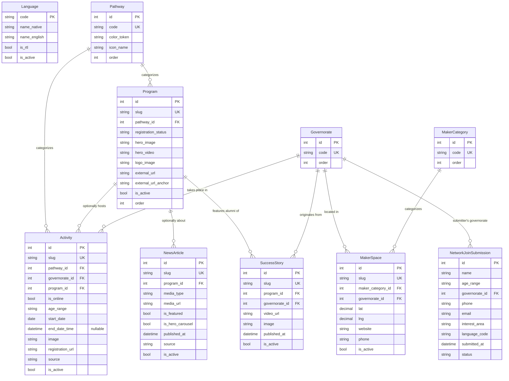
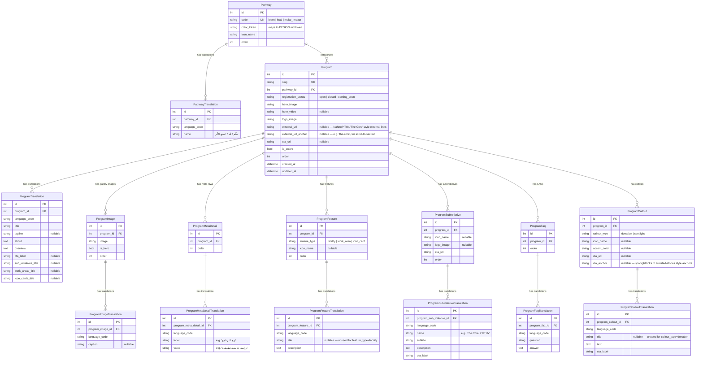
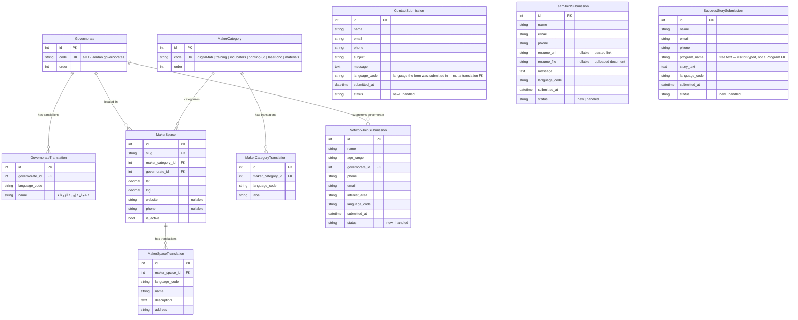

# 05 — Phase 1 Data Model: Entity-Relationship Diagrams

> **Scope:** every entity needed to serve the Phase 1 surface defined in `01-PROJECT_VISION_AND_PHASE1_SCOPE.md` §3 (Home, بوابة الفرص/Programs, Activities, Makers Map, News, Success Stories, About, Contact). Nothing here models the deferred Phase 2 items (`01-...md` §4) — no Partner, Publication, Entity/Directory, or YouthNetwork tables.
> **Derived from:** the actual mock data shapes in `cpf-app/src/data/programsData.js`, `newsData.js`, `makerSpacesData.js`, and `src/data.js` — every entity and field below traces back to a real field the mockup already renders, not a guessed generic shape. See §7 for the full traceability table.
> **i18n requirement:** Phase 1 ships Arabic content only, but per `02-FRONTEND_ARCHITECTURE.md` and `03-BACKEND_ARCHITECTURE_AND_SECURITY.md` the schema must be i18n-ready so English (or any future language) is a **content addition, not a schema migration**. Every entity with user-facing text is split into a language-neutral **master** table and a **`*Translation`** table — see §1 for why this pattern was chosen over the alternative.

---

## 1. Design decision: translation tables, not `_ar`/`_en` column suffixes

Two realistic options for bilingual content in a Django/Postgres stack:

| Approach | How it works | Verdict |
|---|---|---|
| **Column-suffix** (`title_ar`, `title_en`) | Every translatable field gets one column per language. | Rejected as the default. Adding a 3rd language means an actual schema migration across every affected table. Every text-heavy model (Program alone has ~15 translatable fields) doubles its column count for 2 languages, triples for 3. The mockup itself already does a light version of this (`title` / `titleEn` on `Program`) — workable for a 2-language prototype, but doesn't scale to a real CMS. |
| **Translation table** (recommended) | Each translatable model has a matching `<Model>Translation` table: a FK back to the "master" row (`related_name='translations'`), a `language_code` field, and the translatable columns. Uniqueness is enforced via `unique_together('language_code', 'master')`. | **Adopted.** This is the established Django pattern (verified directly against `django-parler`'s documented schema, the most widely used Django translation library — see the exact structure below). Adding a language is a data operation (insert rows with a new `language_code`), never a migration. It's also the natural fit for a Phase 2 CMS: an editor's "content" screen becomes one tab per language, one form per translation row — not a wide form with `_ar`/`_en` fields bolted side by side. |

**Reference schema** (confirmed against `django-parler`'s own documented pattern):
```python
class Program(models.Model):
    slug = models.SlugField(unique=True)
    # ...language-neutral fields only...

class ProgramTranslation(models.Model):
    master = models.ForeignKey(Program, related_name='translations', on_delete=models.CASCADE)
    language_code = models.CharField(max_length=10)  # 'ar' | 'en' | ...
    title = models.CharField(max_length=255)
    # ...other translatable fields...

    class Meta:
        unique_together = ('language_code', 'master')
```

**Why `language_code` is a plain field, not a foreign key to a `Language` table:** this matches the validated pattern — a hard FK would force a join on every single translation lookup for a value that's really just governed by Django's own `settings.LANGUAGES`. A lightweight `Language` **reference/config table** (below) still exists so Phase 2's CMS can list/manage which languages are active without a code change — application code validates `language_code` against it, but the translation tables themselves stay a plain indexed string column for query performance.

```
Language (config/reference — not a hard FK target)
  code (PK, e.g. "ar" / "en"), name_native, name_english, is_rtl, is_default, is_active, order
```

Every `*Translation` table below carries `language_code` values validated against this table.

---

## 2. How to read these diagrams

The full Phase 1 schema is ~40 tables once every translation table is counted, so it's split into **one high-level overview** and **four full-detail domain diagrams** rather than one unreadable mega-diagram — this mirrors how the backend itself is split into Django apps in `03-BACKEND_ARCHITECTURE_AND_SECURITY.md` §2.

1. **§3 — High-Level Domain Overview**: master entities only (no translation/child tables), for understanding how the domains relate.
2. **§4 — Program Domain (full detail)**: every table under `apps/programs/`.
3. **§5 — Content, Home & About Domain (full detail)**: `apps/activities/`, `apps/news/`, `apps/success_stories/`, `apps/about_content/`.
4. **§6 — Networks & Resources / Makers Map Domain (full detail)**: `apps/makers_map/`.
5. **§6 — Forms / Intake Domain (full detail)**: `apps/contact/`.

Legend: `PK` primary key, `FK` foreign key, `UK` unique key/constraint. `||--o{` reads "exactly one, to zero-or-many." `||--o|` reads "exactly one, to zero-or-one" (an optional 1:1).

---

## 3. High-Level Domain Overview



**Reading this diagram:** `Pathway` (تعلّم / قُد / اصنع الأثر) and `Governorate` (Jordan's 12 governorates) are the two lookup tables reused across the widest number of domains — both were discovered by cross-referencing the mock's actual field names (`pathway` appears on both `programsFullData` entries and `allEvents` entries; governorate-shaped strings appear on `allEvents.city`, `allStories.location`, and `makerSpaces.governorate`). Normalizing them once, instead of re-declaring an enum per table, is the direct payoff of reading the mock data closely instead of guessing a schema.

---

## 4. Program Domain (full detail)

`Pathway` is shown fully in this diagram because it's the natural home for it in code (`apps/programs/models.py`, alongside `Program`) — `Activity` in §5 imports and reuses it rather than redefining it, exactly as `Program` and `Pathway` are reused by reference (not redeclared) in §5 and §6.

This is the richest domain in Phase 1 — `programsFullData` in the mock (`src/data/programsData.js`) is a deeply nested object per program (meta details, facilities, sub-initiatives, FAQs, optional donation banner, optional spotlight section, work areas, icon cards). Modeling every nested array as its own bespoke table would produce **six** near-identical "ordered list of icon + title + text scoped to a program" tables. Instead, two deliberate consolidations were made — documented here so the reduction from "what the mock literally has" to "what the schema has" is transparent, not accidental:

- **`ProgramFeature`** merges the mock's `facilities[]`, `workAreas[]`, and `iconCards[]` arrays. All three are structurally identical (an ordered, program-scoped list of an optional icon + optional title + description) and differ only in *which page section renders them* — captured by a `feature_type` enum (`facility` / `work_area` / `icon_card`) instead of three separate tables.
- **`ProgramCallout`** merges the mock's `donationBanner` and `spotlightSection` (both singleton, optional, per-program blocks with an icon/accent, text, and a CTA) via a `callout_type` enum (`donation` / `spotlight`).

`ProgramSubInitiative` and `ProgramFaq` were **not** merged into `ProgramFeature` despite superficial similarity — a sub-initiative has its own logo/CTA identity (it's effectively a "mini-program," e.g. "The Core" under HTU) and an FAQ is a question/answer pair, not an icon+description — both are semantically distinct enough to warrant their own table.



---

## 5. Content, Home & About Domain (full detail)

Covers the Home page's Activities section, بوابة الفرص's Activities tab, News, Success Stories, and every About-page content block. `Activity` and `Program`/`Pathway` are shown again here (reference-only — see §4 for their full definitions) purely so this diagram's foreign keys are legible without flipping back and forth.

**Note on `Activity.points`:** the mock (`src/data.js`, `allEvents[].points`) carries a `points` field on every event. Per `01-PROJECT_VISION_AND_PHASE1_SCOPE.md` §4, points/rewards are explicitly out of scope for Phase 1 — **no `points` column exists on `Activity` below.** This is a deliberate omission, not an oversight.

**Note on `Activity` location modeling:** the mock's `city` field is usually a real governorate name (`'عمان'`, `'إربد'`, ...) but one event uses `'أونلاين'` ("online"). Rather than force "online" into the `Governorate` lookup, `Activity.governorate_id` is nullable and paired with an `is_online` boolean — this was only discoverable by reading the actual mock data, not by guessing a generic "location" field.

**Note on `Activity` program relation:** unlike `NewsArticle` and `SuccessStory` — both of which carry an explicit `programKey` field in the mock (`newsData.js`, `allStories[]`) — `data.js` → `allEvents[]` has **no structured field linking an activity to a program**. The nullable `Activity.program_id` FK below is therefore an **architectural inference, not a mock-derived field**. It exists because (a) one mock event's free-text `location` happens to name a program verbatim (`'جامعة الحسين التقنية (HTU)'` on the cybersecurity hackathon, id 8), suggesting the concepts are related in practice even though the mock never formalizes it, and (b) Program detail pages already render program-scoped News and Success Stories via the same `programKey` pattern (`ProgramNewsSection.jsx`, `RelatedProgramStories.jsx`) — a program page eventually wanting to list its own upcoming activities is the natural next case. Keeping the FK nullable now means that if/when this is needed, it's a data-population task, not a schema migration; standalone activities with no program affiliation (the seasonal community campaigns, for instance) simply leave it null.

```mermaid
erDiagram
    Activity ||--o{ ActivityTranslation : "has translations"
    Program ||--o{ Activity : "optionally hosts"
    Pathway ||--o{ Activity : categorizes
    Governorate ||--o{ Activity : "takes place in (nullable)"

    NewsArticle ||--o{ NewsArticleTranslation : "has translations"
    Program ||--o{ NewsArticle : "optionally about"

    FieldLensImage ||--o{ FieldLensImageTranslation : "has translations"

    SuccessStory ||--o{ SuccessStoryTranslation : "has translations"
    Program ||--o{ SuccessStory : "features alumni of"
    Governorate ||--o{ SuccessStory : "originates from"

    Quote ||--o{ QuoteTranslation : "has translations"
    FoundationRoleText ||--o{ FoundationRoleTextTranslation : "has translations"
    StatCounter ||--o{ StatCounterTranslation : "has translations"
    TimelineEntry ||--o{ TimelineEntryTranslation : "has translations"
    Leader ||--o{ LeaderTranslation : "has translations"

    Activity {
        int id PK
        string slug UK
        int pathway_id FK
        int governorate_id FK "nullable — see is_online"
        int program_id FK "nullable"
        bool is_online
        string age_range "e.g. '18-25', 'الكل'"
        date start_date
        datetime end_date_time "nullable — for events with a specific end time"
        string image
        string registration_url "nullable"
        string source "seed | impact_system (Athar Sphere) — Phase 2 seam, see 01-...md §7"
        bool is_active
        datetime created_at
    }
    ActivityTranslation {
        int id PK
        int activity_id FK
        string language_code
        string title
        text description
        string location_label "e.g. 'مجمع الملك الحسين للأعمال'"
    }

    NewsArticle {
        int id PK
        string slug UK
        int program_id FK "nullable"
        string media_type "image | video"
        string media_url
        string cover_image "nullable"
        bool is_featured "drives homepage top-3 carousel"
        bool is_hero_carousel
        datetime published_at
        string source "live_site_seed | cms"
        bool is_active
    }
    NewsArticleTranslation {
        int id PK
        int news_article_id FK
        string language_code
        string title
        text summary
        text body "nullable — full article body for detail page"
    }

    FieldLensImage {
        int id PK
        string image
        date date "for chronological sorting"
        int order
        bool is_active
    }
    FieldLensImageTranslation {
        int id PK
        int field_lens_image_id FK
        string language_code
        string title
    }

    SuccessStory {
        int id PK
        string slug UK
        int program_id FK "nullable"
        int governorate_id FK "nullable"
        string video_url "nullable"
        string image
        datetime published_at
        bool is_active
    }
    SuccessStoryTranslation {
        int id PK
        int success_story_id FK
        string language_code
        string name
        string subtitle "nullable — e.g. 'مكتب مؤسسة ولي العهد'"
        text quote
        text full_story
    }

    Quote {
        int id PK
        bool is_active
        int order
    }
    QuoteTranslation {
        int id PK
        int quote_id FK
        string language_code
        text text
        string attribution
    }

    FoundationRoleText {
        int id PK
        bool is_active
        datetime updated_at
    }
    FoundationRoleTextTranslation {
        int id PK
        int foundation_role_text_id FK
        string language_code
        text text "verbatim client-provided paragraph — 01-...md §3.8"
    }

    StatCounter {
        int id PK
        string code UK "beneficiaries | programs | governorates | partners | employees | locations"
        decimal value
        string display_suffix "nullable — 'K', '+', ..."
        string icon_name "nullable"
        bool show_on_home
        bool show_on_about
        int order
        bool is_active
    }
    StatCounterTranslation {
        int id PK
        int stat_counter_id FK
        string language_code
        string label "شريك / موظف / محافظة / ..."
    }

    TimelineEntry {
        int id PK
        string year_label "from CPF TIMELINE.xlsx"
        int order
        bool is_active
    }
    TimelineEntryTranslation {
        int id PK
        int timeline_entry_id FK
        string language_code
        string title
        text description
    }

    Leader {
        int id PK
        string leadership_type "board | executive"
        string card_image
        string detail_media_type "image | video"
        string detail_media_url "nullable"
        int order
        bool is_active
        datetime created_at
        datetime updated_at
    }
    LeaderTranslation {
        int id PK
        int leader_id FK
        string language_code
        string name
        string position
        text bio "nullable"
    }
```



**Note on `Leader` (قيادات المؤسسة):** originally added directly on instruction with no known mock precedent — that turned out to be incomplete. `cpf-app/src/pages/AboutPage.jsx` has a full `leaders{board, executive}` array (10 board members, 5 executive members; `name`/`role`/`image`, with `bio` and one `video` on a couple of entries) that maps closely onto the structure above. See `07-DATA_MODEL_ERD_RATIONALE.md` §4.2 for the correction and full field mapping, including why it carries both a `card_image` (for a listing/grid view) and a separate `detail_media_type`/`detail_media_url` pair (for an expanded bio view that may show a video instead of a photo) — that part of the reasoning was already right, only the provenance claim was wrong.

---

## 6. Networks & Resources (Makers Map) and Forms / Intake Domains (full detail)

Per `01-PROJECT_VISION_AND_PHASE1_SCOPE.md` §3.4, Phase 1's "شبكات وموارد" tab ships **Makers Map only** — Entities Directory and Youth Networks are deferred, so no `Entity`/`EntityCategory`/`YouthNetwork` tables appear here or anywhere in this ERD.



**Why `ContactSubmission` and `NetworkJoinSubmission` have no translation table:** both are *user-submitted* data, not CMS-authored content — there's nothing to translate. `language_code` here just records which language the visitor used, for support/reporting purposes (matches `03-BACKEND_ARCHITECTURE_AND_SECURITY.md` §4.7). `TeamJoinSubmission` and `SuccessStorySubmission` follow the same rule for the same reason.

**Note on `TeamJoinSubmission` and `SuccessStorySubmission`:** both were added directly on instruction, and — like `Leader` turned out to be, once corrected — each corresponds to a real, already-built (and previously unmodeled) piece of mock UI: `Contact.jsx`'s "careers" tab already has a full CV-submission modal, and `success/ShareStoryModal.jsx` already implements a 3-step "share your story" flow. Neither ever had a backing schema table before now. `TeamJoinSubmission.resume_url`/`resume_file` are split into two nullable fields (rather than one ambiguous field) so the schema doesn't leave the "pasted link vs. uploaded file" distinction for application code to invent — application logic should enforce that exactly one is set. See `07-DATA_MODEL_ERD_RATIONALE.md` §4.4 for the full field-by-field comparison against what these two mock components actually collect today, which differs from the field list implemented here in a few places worth a follow-up decision.

---

## 7. Traceability: mock data → schema

For anyone auditing whether this schema actually reflects the product (rather than a generic guess), every entity below cites the exact mock field(s) it was derived from.

| Entity | Derived from (mock file → field) |
|---|---|
| `Pathway` | `programsData.js` → `pathway` ('تعلّم' / 'قُد' / 'اصنع الأثر'), also present on `data.js` → `allEvents[].pathway` |
| `Program` + `ProgramTranslation` | `programsData.js` → `programsFullData` keys: `title`/`titleEn`, `tagline`, `about`, `overview`, `image`, `video`, `logo`, `ctaLabel`/`ctaUrl`, `registrationStatus` |
| `ProgramImage` | Not yet in the mock (mock has one `image` per program) — added per `01-...md` §3.2's explicit "3–4 curated photos per program" requirement |
| `ProgramMetaDetail` | `programsData.js` → `metaDetails: [{label, value}]` |
| `ProgramFeature` | `programsData.js` → `facilities: []`, `workAreas: [{title, text}]`, `iconCards: [{icon, title, description}]` (consolidated, see §4) |
| `ProgramSubInitiative` | `programsData.js` → `subInitiatives: [{name, subtitle, description, icon, ctaLabel, ctaUrl}]` (e.g. "The Core", "HTUx") |
| `ProgramFaq` | `programsData.js` → `faqs: [{q, a}]` |
| `ProgramCallout` | `programsData.js` → `donationBanner: {icon, accent, text, ctaLabel, ctaUrl}` and `spotlightSection: {title, text, ctaLabel, ctaAnchor}` (consolidated, see §4) |
| `Activity` + `ActivityTranslation` | `data.js` → `allEvents[]`: `title`, `date`, `city`, `location`, `pathway`, `ageRange`, `image`, `description` (`points` deliberately dropped, see §5) (*Note: `program_id` is an architectural inference for CMS flexibility, `end_date_time` is an architectural addition for events with a specific end time; neither is found in the mock data*) |
| ~~`NewsCategory` + `NewsCategoryTranslation`~~ | **Removed** — the mock's `category` strings existed on `newsList[]`/`heroSliderNews[]`, but the client has not requested news filtering by category; keeping a lookup table for a filter nobody asked for is scope creep (YAGNI), see §8 |
| `NewsArticle` + `NewsArticleTranslation` | `newsData.js` → `newsList[]`: `title`, `desc`, `image`, `date`, `isFeatured`, `programKey`; `heroSliderNews[]`: `type`, `mediaUrl` (*Note: no `news_category_id` — see the `NewsCategory` row above*) |
| `FieldLensImage` | `newsData.js` → `pulseImages[]`: `title`, `url` — this is "عدسة الميدان" (*Note: `type`/`layout_type` removed — all images use a normal layout now, per direct instruction; `date` added for chronological sorting, also per direct instruction, not found in the mock*) |
| `SuccessStory` + `SuccessStoryTranslation` | `data.js` (`allStories[]`, imported into `programsData.js`'s file for convenience): `name`, `program`/`programKey`, `location`, `video`, `image`, `quote`, `fullStory` (*Note: `subtitle` is an architectural refinement, not a direct field copy — see §4.2/§8 for why some `program` values in the mock, e.g. "مكتب المؤسسة في عجلون", don't actually resolve to a `Program` and need their own label field; `batch_number` was removed — see §8*) |
| `Quote`, `FoundationRoleText`, `StatCounter`, `TimelineEntry` | Not literal mock data structures (the mockup hardcodes About page copy inline) — modeled directly from `01-PROJECT_VISION_AND_PHASE1_SCOPE.md` §3.8's explicit content requirements (quote selection, the verbatim "دور المؤسسة" paragraph, new "4.5K شريك"/"120 موظف" stats, `CPF TIMELINE.xlsx`) |
| `Leader` + `LeaderTranslation` | `cpf-app/src/pages/AboutPage.jsx` → `leaders{board, executive}` array (10+5 people, `name`/`role`/`image`, occasional `bio`/`video`) — added directly on instruction, then found to already exist in the mock once implementation started. Corrected from an earlier "no precedent" claim; see `07-DATA_MODEL_ERD_RATIONALE.md` §4.2 |
| `Governorate` | `programs/networks/MakersMap.jsx` → `GOVERNORATES` array (all 12: إربد، العقبة، مأدبا، الكرك، الطفيلة، عمان، الزرقاء، عجلون، جرش، معان، البلقاء، المفرق) |
| `MakerCategory` | `makerSpacesData.js` → `MAKER_CATEGORIES: [{id, label}]` |
| `MakerSpace` + `MakerSpaceTranslation` | `makerSpacesData.js` → `makerSpaces[]`: `name`, `category`, `governorate`, `description`, `address`, `website`, `lat`, `lng` |
| `ContactSubmission` | `Contact.jsx` general contact form fields (name, email, phone, subject, message) |
| `NetworkJoinSubmission` | `Contact.jsx` "انضم لشبكتنا" tab form fields: name, age-range select, governorate select, phone, email, interest-area select |
| `TeamJoinSubmission` | Given field list added directly on instruction — but a real, unmodeled precedent already exists: `Contact.jsx`'s "careers" tab CV-submission modal (name, specialization field, required PDF upload; no email/phone/message today). See `07-DATA_MODEL_ERD_RATIONALE.md` §4.4 for the full discrepancy list |
| `SuccessStorySubmission` | Given field list added directly on instruction — a real, unmodeled precedent already exists: `success/ShareStoryModal.jsx`'s 3-step form (name, program/initiative select, optional title, story text, optional photo upload, optional video/social link; no email/phone today). See `07-DATA_MODEL_ERD_RATIONALE.md` §4.4 for the full discrepancy list |

---

## 8. What's intentionally absent

Consistent with `01-PROJECT_VISION_AND_PHASE1_SCOPE.md` §4: no `Partner`/`Partnership` model, no `Publication` model, no `Entity`/`EntityCategory` (Directory) model, no `YouthNetwork` model, and — critically — **no points/rewards field anywhere** in this schema, even though the mock's `Activity`-equivalent data (`allEvents[].points`) has one. If a future ticket asks to "just add it back since we're touching the table anyway," that's scope creep this diagram was built specifically to make visible and preventable.

**No `AboutMap` table.** An earlier revision of this schema modeled the About page's pending map (§3.8's client note that a map is planned, asset pending from Ahmad Marei) as its own table with a `json embed_config` field, reasoning it would let the layout ship now and the asset slot in later without a migration. On review, that's over-engineering for what is, in Phase 1, a single static map on one page — a dedicated table, API route, and future CMS screen for one embed is unwarranted complexity (a YAGNI violation) when a hardcoded Next.js component or an environment variable does the same job with none of the overhead. See `07-DATA_MODEL_ERD_RATIONALE.md` §4.2 for the full reasoning and what replaces it.

**No `NewsCategory` / `NewsCategoryTranslation` tables.** An earlier revision modeled news categories (`أخبار المؤسسة`, `إنجازات الشباب`, `شراكاتنا`, `أخبار الفرص`) as a normalized lookup, mirroring how `Pathway` and `Governorate` were normalized. The client has not requested filtering news by category, and the mock itself never filters on `category` — it's a display label only. Building a lookup table, its translation table, and a `news_category_id` FK for a filter nobody asked for is exactly the kind of speculative generality YAGNI warns against. News is now a flat list ordered by `published_at`; if category filtering becomes a real requirement later, it's a straightforward addition, not a correction of an existing mistake.

**No `SuccessStory.batch_number`.** The client's notes describe success stories arriving in batches ("we will send the other batches as soon as we receive them"), which is what originally motivated this field. In practice it would be null for the large majority of stories and adds a concept ("batch") that has no corresponding UI or filter anywhere in the mock or the scope document — it was solving an ingestion/content-ops question with a schema field instead of, say, an admin import log or a `created_at` sort. Removed for the same reason as `NewsCategory`: modeling a distinction nothing currently reads.

**No `FieldLensImage.layout_type`.** Originally modeled to mirror the mock's `pulseImages[].type` (`featured`/`normal`/`tall`), which drove a masonry-style grid with mixed tile sizes. Removed on direct instruction — all images use a normal layout, so the field has no value left to distinguish. `date` was added in its place for chronological sorting, which `layout_type` never provided anyway.
