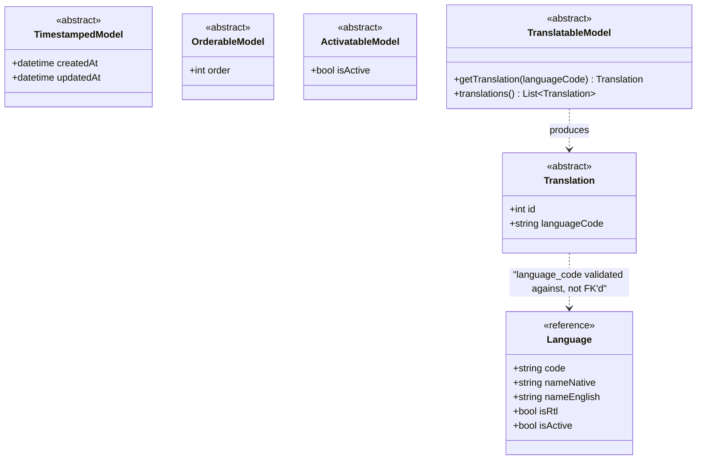
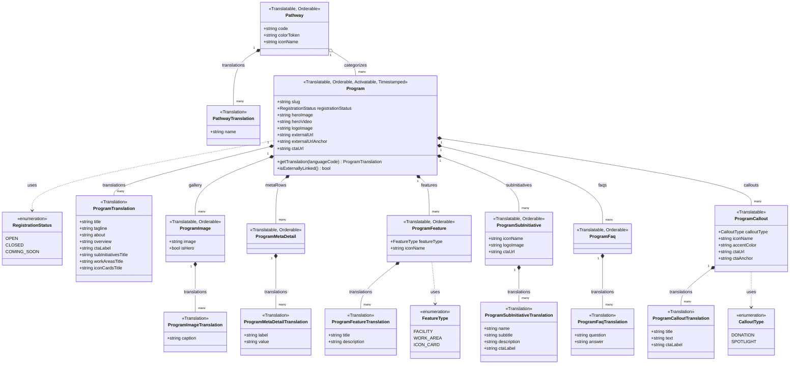
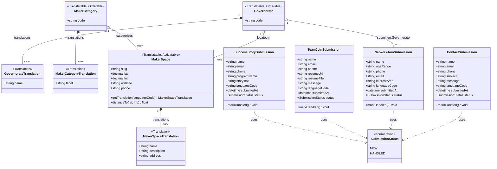

# 06 — Phase 1 Data Model: UML Class Diagrams

> **Companion to `05-DATA_MODEL_ERD.md`.** That document models the schema relationally — tables, foreign keys, cardinalities. This document models the **same entities** as an object system — classes, inheritance, composition vs. aggregation, and behavior — because a Django project is not just a set of tables, it's a set of Python classes, and several structural facts about this schema only show up once you draw it that way.

---

## 1. Why a separate diagram, not just the ERD relabeled

An ER diagram and a UML class diagram describe the same database, but they answer different questions, and both are useful to a team implementing this from scratch:

| Question | Answered by |
|---|---|
| What tables exist, what columns do they have, how do foreign keys connect them? | `05-DATA_MODEL_ERD.md` (Entity-Relationship) |
| What's actually **owned** by what (deleted together) vs. merely **referenced** (a shared lookup)? What's inherited/reusable across many models instead of repeated per-model? What behavior does each object expose, not just what data does it hold? | This document (UML) |

Three things this diagram makes explicit that the ERD doesn't:

1. **Composition vs. aggregation, drawn differently on purpose.** Every `Program → ProgramTranslation` (and every other master → `*Translation` relationship) is drawn as a **filled-diamond composition** (`*--`): a translation row has no independent existence and is deleted along with its master (`on_delete=CASCADE`). Every `Program → Pathway`-style relationship is drawn as a **hollow-diamond aggregation** (`o--`): a `Pathway` is a shared lookup that a `Program` references but does not own — deleting a `Program` must never delete the `Pathway` row it pointed to. The ERD's crow's-foot notation doesn't distinguish these two cases; the ownership difference matters directly for how `on_delete` is configured on every FK in Django.
2. **Shared abstractions, modeled once instead of repeated ~20 times.** Nearly every entity in `05-...md` independently repeats `is_active`, `order`, `created_at`/`updated_at`, and the "has a `*Translation` table" pattern. Here those are pulled out into four small abstract base classes (§2) that concrete classes inherit from — which is also literally how this should be implemented in Django (`abstract = True` base model classes), not just a diagramming convenience.
3. **Behavior, not just data.** A few representative methods are shown per aggregate root (e.g. `Program.get_translation(language_code)`, `Activity.is_upcoming()`) to make the point that these are objects with responsibilities, not passive rows — useful for the team deciding where business logic (as opposed to template logic) should live.

**Everything else is identical to `05-...md`**: the same ~40 entities, the same fields, the same Phase 1 scope boundary (no Partner/Publication/Directory/YouthNetwork classes, no points/rewards field). Read `05-...md` first if you haven't — this document assumes that context and doesn't re-derive it.

---

## 2. Core abstractions & enumerations

Four abstract base classes, defined once, inherited everywhere. `Translation` classes never inherit `Orderable`/`Activatable` — a translation follows its master's status, it doesn't carry its own.

Every concrete class below is annotated with a stereotype listing which of these it inherits — e.g. `<<Translatable, Orderable, Activatable, Timestamped>>` — instead of re-drawing the inheritance arrow on every diagram, which would make each domain diagram mostly about scaffolding instead of the domain. **Attributes inherited from these four base classes are omitted from every class body below** to avoid repeating `id` / `isActive` / `order` / `createdAt` / `updatedAt` ~20 times — this reduction is itself one of the payoffs of modeling it this way (see §1.2).

---

## 3. Program domain

**Reading the ownership semantics:** `Program *-- ProgramFeature` (filled diamond) because a feature row is meaningless and undeletable-independently outside its program. `Pathway o-- Program` (hollow diamond) because `Pathway` ('تعلّم' / 'قُد' / 'اصنع الأثر') is a small, shared, admin-managed lookup — many programs reference the same `Pathway` row, and deleting a program must never cascade into deleting the pathway itself.

---

## 4. Content, Home & About domain

```mermaid
classDiagram
    class MediaType {
        <<enumeration>>
        IMAGE
        VIDEO
    }
    class ActivitySource {
        <<enumeration>>
        SEED
        IMPACT_SYSTEM
    }
    class NewsSource {
        <<enumeration>>
        LIVE_SITE_SEED
        CMS
    }
    class Activity {
        <<Translatable, Activatable, Timestamped>>
        +string slug
        +bool isOnline
        +string ageRange
        +date startDate
        +datetime endDateTime
        +string image
        +string registrationUrl
        +ActivitySource source
        +getTranslation(languageCode) ActivityTranslation
        +isUpcoming() bool
    }
    class ActivityTranslation {
        <<Translation>>
        +string title
        +string description
        +string locationLabel
    }

    class NewsArticle {
        <<Translatable, Activatable>>
        +string slug
        +MediaType mediaType
        +string mediaUrl
        +string coverImage
        +bool isFeatured
        +bool isHeroCarousel
        +datetime publishedAt
        +NewsSource source
        +getTranslation(languageCode) NewsArticleTranslation
        +isInHomeCarousel() bool
    }
    class NewsArticleTranslation {
        <<Translation>>
        +string title
        +string summary
        +string body
    }

    class FieldLensImage {
        <<Translatable, Orderable, Activatable>>
        +date date
        +string image
    }
    class FieldLensImageTranslation {
        <<Translation>>
        +string title
    }

    class SuccessStory {
        <<Translatable, Activatable>>
        +string slug
        +string videoUrl
        +string image
        +datetime publishedAt
        +getTranslation(languageCode) SuccessStoryTranslation
    }
    class SuccessStoryTranslation {
        <<Translation>>
        +string name
        +string subtitle
        +string quote
        +string fullStory
    }

    class Quote {
        <<Translatable, Orderable, Activatable>>
    }
    class QuoteTranslation {
        <<Translation>>
        +string text
        +string attribution
    }

    class FoundationRoleText {
        <<Translatable, Activatable, Timestamped>>
    }
    class FoundationRoleTextTranslation {
        <<Translation>>
        +string text
    }

    class StatCounter {
        <<Translatable, Orderable, Activatable>>
        +string code
        +decimal value
        +string displaySuffix
        +string iconName
        +bool showOnHome
        +bool showOnAbout
    }
    class StatCounterTranslation {
        <<Translation>>
        +string label
    }

    class TimelineEntry {
        <<Translatable, Orderable, Activatable>>
        +string yearLabel
    }
    class TimelineEntryTranslation {
        <<Translation>>
        +string title
        +string description
    }

    class Leader {
        <<Translatable, Orderable, Activatable, Timestamped>>
        +string leadershipType
        +string cardImage
        +MediaType detailMediaType
        +string detailMediaUrl
    }
    class LeaderTranslation {
        <<Translation>>
        +string name
        +string position
        +string bio
    }

    Pathway "1" o-- "many" Activity : categorizes
    Governorate "1" o-- "0..*" Activity : takesPlaceIn
    Program "1" o-- "0..*" Activity : optionallyHosts
    Program "1" o-- "0..*" NewsArticle : optionallyAbout
    Program "1" o-- "0..*" SuccessStory : featuresAlumniOf
    Governorate "1" o-- "0..*" SuccessStory : originatesFrom

    Activity "1" *-- "many" ActivityTranslation : translations
    NewsArticle "1" *-- "many" NewsArticleTranslation : translations
    FieldLensImage "1" *-- "many" FieldLensImageTranslation : translations
    SuccessStory "1" *-- "many" SuccessStoryTranslation : translations
    Quote "1" *-- "many" QuoteTranslation : translations
    FoundationRoleText "1" *-- "many" FoundationRoleTextTranslation : translations
    StatCounter "1" *-- "many" StatCounterTranslation : translations
    TimelineEntry "1" *-- "many" TimelineEntryTranslation : translations
    Leader "1" *-- "many" LeaderTranslation : translations

    Activity ..> ActivitySource : uses
    NewsArticle ..> MediaType : uses
    Leader ..> MediaType : uses
    NewsArticle ..> NewsSource : uses
```

`Pathway`, `Governorate`, and `Program` are reused here **by reference** (aggregation only, no attributes redrawn) — their full class definitions live in §3 (`Pathway`, `Program`) and §5 (`Governorate`). `ActivitySource` and `NewsSource` are kept as two distinct enumerations rather than merged into one generic "content source" enum: they encode genuinely different concepts (`Activity`'s source is about the pending Impact System (Athar Sphere) integration seam from `01-...md` §7; `NewsArticle`'s source is about whether a row came from the one-time live-site content seed or the future CMS).

`Leader` deliberately reuses the existing `MediaType` enumeration (`IMAGE`/`VIDEO`) for `detailMediaType` rather than introducing a near-identical enum of its own — same values, same meaning, no reason to duplicate it. See `07-DATA_MODEL_ERD_RATIONALE.md` §4.2 — `Leader` was originally believed to have no mock precedent; that was corrected once `AboutPage.jsx`'s `leaders{board, executive}` array was found.

---

## 5. Networks & Resources and Forms domain

**Why `ContactSubmission` and `NetworkJoinSubmission` don't inherit `TranslatableModel`:** they're visitor-submitted data, not CMS-authored content — there's nothing to translate. `languageCode` here is a plain recorded fact ("what language did the visitor submit in"), not a translation key, which is exactly why it's a flat field on the class itself rather than a `Translation` composition — the same distinction made in `05-...md` §6. `TeamJoinSubmission` and `SuccessStorySubmission` follow the same rule, for the same reason. Note `SuccessStorySubmission.programName` has no relationship line to `Program` at all (not even aggregation) — it's a plain field, deliberately not an FK; see `07-DATA_MODEL_ERD_RATIONALE.md` §4.4 for why.

---

## 6. What's intentionally absent

Same boundary as `05-DATA_MODEL_ERD.md` §8: no `Partner`, `Publication`, `Entity`/`EntityCategory`, or `YouthNetwork` classes, and no points/rewards attribute on `Activity` or anywhere else. This document doesn't relitigate that scope — it only re-presents the same in-scope entities through an object-oriented lens.
